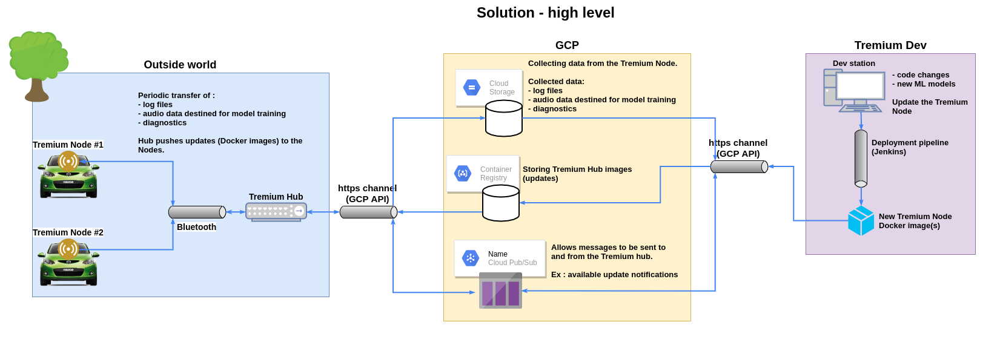

# Tremium

### Tremium is a system that monitors machinery and enables preventive maintenance.
 

 

The whole idea is to use a simple and inexpensive sensor (a microphone) with some complex ML flavoured algorithms in order to identify and diagnose machinery problems. The tremium system can do this in real time by utilising a dedicated device **(raspberry pi 4)** mounted on the machine of interest.
To simplify the project, I narrowed down the “machinery” to just automobiles, more specifically, my **Mazda 3 2013**.
 

### General graph of the solution

 

### The project can be divided into two main categories
+ **Infrastructure**
    + Tremium Node architecture
    + Tremium Hub architecture
    + Hardware and mounting
    + Google cloud infrastructure
    + Pushing updates Tremium Node(s)
    + Collecting data from the Tremium Node(s)

+ **Noise recognition and diagnostics**
    + Defining audio events
    + Generic audio event extractor
    + Training the audio classifiers
    + Real time classification